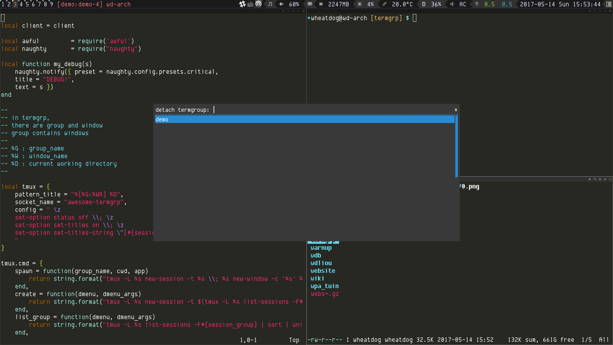

# awesome-termgrp

awesome-termgrp is a plugin for [Awesome window manager][].
It tries to solve the problem of using tmux inside a tiling
window manager. That is, let tmux manages sessions and let 
AwesomeWM manages window layout.

## Motivation

I always find it is uncomfortable to use tmux inside a tiling window manger.
It's frustrated and tired to think what key should I press before jumping
to another window. There are some discussions on reddit like [this](https://www.reddit.com/r/vim/comments/1mhqdw/is_it_worth_it_to_use_tmux_or_screen_with_a/) 
and [this](https://www.reddit.com/r/awesomewm/comments/zj0ne/awesometmux_workflowhow_do_you_work/), and there are [some](https://news.ycombinator.com/item?id=12903652) in Hacker News too.
It seems redundant to make two programs handle same thing.
However, tmux has its usage. It can group up terminals to form sessions, 
which is useful to manager projects. And it offers scrollback buffer feature
for simple terminal emulators like [st][].

## Screenshot



## How does it work?

It uses the concept of `session` and `window group` in tmux. Sessions with same
window group can let users have different view of the same set of windows.
A `group` in awesome-termgrp is a `window group` in tmux.

awesome-termgrp uses its own server socket (`tmux -L awesome-termgrp`) and
applies some additional tmux setting using session variables. 
It will still load `~/.tmux.conf`, but you can add other tmux settings for 
termgrp without modifing it.

## Installation

awesome-termgrp has been developed under Awesome v4.1+. It might be broken on previous versions.

Create a subdirectory `termgrp` in your awesome config directory, e.g.

```
cd ~/.config/awesome
git clone https://github.com/wheatdog/awesome-termgrp termgrp
```

Then, include this plugin from your config file (`~/.config/awesome/rc.lua`)

```lua
local termgrp = require('termgrp')
```

## How to use?

### Optional Configuration

You can configure default setting after loading `termgrp`

```lua
termgrp.terminal = "urxvt"
termgrp.dmenu = "dmenu"
```

If you want to make new windown start with the same directory 
of the current one, You may need to add following line to your 
initialization file.

In `~/.bashrc` if your are using `bash`,
```bash
PROMPT_COMMAND='echo -ne "\033]0;$PWD\007"'
```

Or you could modify `termgrp.group_manager_built_in.tmux.pattern_title`.

### Keybindings

You can modify following keybindings and add them to `globalkeys`,
```lua
-- Create a new termgrp
-- Like tmux new-session
awful.key({ modkey,           }, "=", function() termgrp.action.create("-p \"create termgroup (don't use following names): \"") end),

-- Detach a termgrp
-- Like tmux detach-client
awful.key({ modkey, "Shift"   }, "=", function() termgrp.action.detach("-p \"detach termgroup: \"") end),

-- Attach a termgrp
-- Like tmux attach-session
awful.key({ modkey, "Ctrl"    }, "=", function() termgrp.action.attach("-p \"attach termgroup: \"") end),

-- If user focuses on a window of a termgrp, launch a terminal in the same termgrp.
-- Otherwise, launch a normal terminal.
-- Like tmux new-window
awful.key({ modkey, "Shift" }, "Return", function() termgrp.action.spawn() end,
    {description = "open a terminal", group = "launcher"}),

-- If user focuses on a window of a termgrp, launch a terminal app in the same termgrp.
-- Otherwise, launch a normal terminal app.
-- Like tmux new-window app
app = "ranger"
awful.key({ modkey }, "r", function() termgrp.action.spawn(app) end,
    {description = "open file manager", group = "launcher"}),

```

You can modify following keybindings and add them to `clientkeys`,
```lua
-- Like tmux kill-window
awful.key({ modkey, "Shift"   }, "c", function (c) termgrp.action.kill(c) end,
        {description = "close", group = "client"}),
```

### Tips

#### Why it doesn't close window properly after typing `exit`?

You may want to overwrite `exit` inside the initialization file of your desired shell. 
e.g. If you are using `bash`, add following codes into `~/.bashrc`

```bash

function exit() {
    if [ -n "$TMUX" ] && [ "$(basename $(echo $TMUX | cut -d, -f1))" = "awesome-termgrp" ]; then
        if [ $(tmux list-window | wc -l) -gt 1 ]; then
            tmux kill-window \; kill-session
        else
            tmux kill-window 
        fi
    else
        builtin exit
    fi
}

```

## Acknowledgement

Thank Rudis Muiznieks for his blog post - [Using Tmux with a Single Global Session](https://www.codeword.xyz/2015/10/21/using-tmux-with-a-single-global-session/)

Thank chakrit for his inspiring gist - [TMUX - Single window group, multiple session](https://gist.github.com/chakrit/5004006)

## Future Work

Comment codes to make others easier to configure settings.

Make `termgrp.action.create` foolproof.

Figure out a better way to make Awesome understanding what tmux window/session it currently focuses on other than parsing window's title

Support different terminal session managers like `screen` or `abduco`.

[awesome window manager]: https://awesomewm.org/
[st]: http://st.suckless.org/
